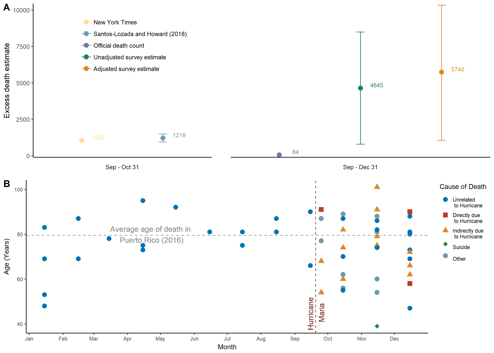

# Introduction
Here we provide the data and pipeline for:  **The Mortality in Puerto Rico after Hurricane Maria** (doi:)  

# Abstract

Background: 
Quantifying the effect on society of natural disasters is critical for recovery of
public health services and infrastructure. The death toll can be difficult to
assess in the aftermath of a major disaster. In September 2017, Hurricane Maria
caused massive infrastructural damage to Puerto Rico, but its effect on mortality
remains contentious.

Methods: 
Using a representative, stratified sample, we surveyed 3299 randomly chosen
households across Puerto Rico to produce an independent estimate of all-cause
mortality after the hurricane. Respondents were asked about displacement,
infrastructure loss, and causes of death. We calculated excess deaths by
comparing our estimated post-hurricane mortality rate with official rates for the
same period in 2016.

Results: 
From the survey data, we estimated a mortality rate of 14.3 deaths (95%
confidence interval [CI], 9.8 to 18.9) per 1000 persons from September 20
through December 31, 2017. This rate yielded a total of 4645 excess deaths
during this period (95% CI, 793 to 8498), equivalent to a 62% increase in the
mortality rate as compared with the same period in 2016. However, this
number is likely to be an underestimate because of survivor bias. The mortality
rate remained high through the end of December 2017, and one third of the
deaths were attributed to delayed or interrupted health care. Hurricane-related
migration was substantial.

Conclusions: 
The official estimate of 64 deaths attributed to Hurricane Maria in Puerto Rico
is a substantial underestimate. This survey, based on community sampling,
indicated that the number of excess deaths is likely to be more than 70 times
the official estimate. (Funded by the Harvard T.H. Chan School of Public
Health and others.)

a) A comparison of excess death estimates from official reports, press/academic reports, and our survey. b) Reported deaths per month in the survey, categorized by reported cause of death. Two individuals who died of similar causes are superimposed in December who died at the same age resulting in a count of 37 points representing 38 deaths after the hurricane.

# Organization
- `code`  — Scripts and output for figures included in the manuscript and supplement
- `data`  — Initial data resources and survey data (*more information in the folder `README`* )
- `figures` — Final figures included in manuscript
- `ref` — pipelines used to clean raw information and generate `.RDS` files found in `/data/rdata/`

# Use
- `master` is locked  
- Feel free to create a new branch for further incorporation and analysis  
- All geospatial data has been stripped; by using this dataset, you agree to not undertake any steps to identify any respondents or their families
- More information in `data`

# Correspondence
For any issues with anonymization or major issues with the functionality of the script please [create an issue](https://github.com/c2-d2/pr_mort_official/issues).

## License
The data collected and presented is licensed under the [Creative Commons Attribution 3.0 license](http://creativecommons.org/licenses/by/3.0/us/deed.en_US), and the underlying code used to format, analyze and display that content is licensed under the [MIT license](http://opensource.org/licenses/mit-license.php).
