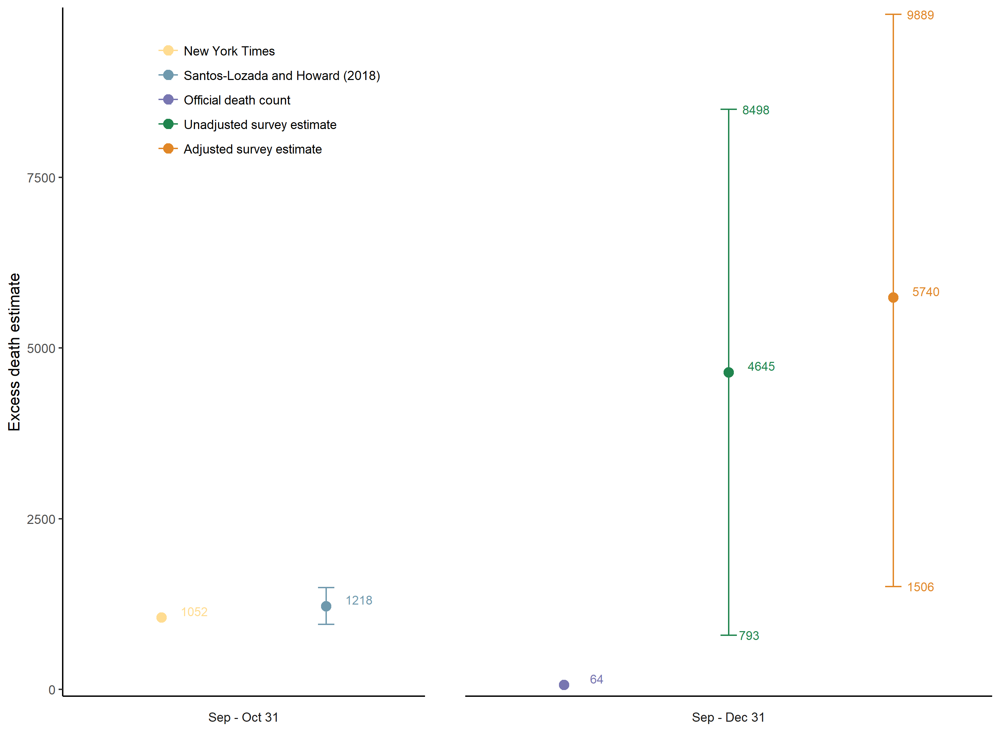

Hurricane Maria Mortality Study (NEJM online, Kishore et al., May 29 2018)

Available online: https://www.nejm.org/doi/full/10.1056/NEJMsa1803972

Last updated: `r format(Sys.time(), "%B %d, %Y")`

## FAQs
In response to the overwhelming media response and inquiries, the authors have prepared this document to answer frequently asked questions.

## What is the bottom line?
- We estimated that the mortality rate (the number of deaths per 1000 people per unit time) remained high for months after the hurricane. This suggests that people continued to suffer even after the hurricane passed. 
- Our data suggests that about one third of those that died after the hurricane died from delayed or interrupted medical care, as reported by the surveyed households.
- Even the low-bound of our estimates is consistent with earlier academic and press reports about the high mortality rate. 
- We intentionally used a simple method, but there are many ways to calculate excess deaths. We have made all data available and welcome other researchers’ analyses.

## How many people died?
We do not know exactly how many people died. Our estimates are based on a household survey, where we visited 3299 randomly selected houses across the island. Because the survey is based on a random sample, there is uncertainty associated with our estimate. Our analysis suggests that between 793 and 8498 people died after the hurricane and up to the end of 2017, either directly or indirectly due to the hurricane. 

## Does your study say that 4645 died? 
No. We provide a 95% confidence interval of 793 to 8498, and 4645 falls in the middle of this range. 

## What is a confidence interval? 
We implemented an approach that generates a confidence interval that has a 95% chance of including the actual death count. We followed a standard statistical approach to calculate this interval. Our estimate is based on a random sample of the entire population. If we took a different random sample, and followed the same statistical approach, we would end up with a different interval due to random variability introduced by the sampling — because we would end up picking a different set of households. If one had unlimited resources, and continued to take random samples, 95% of the resulting confidence intervals would include the actual death count. All this requires certain assumptions to hold; some are described in our paper, others described in basic statistics textbooks. 

## Why is your confidence interval so large?
Deaths are relatively rare events. We were able to survey 3299 households and found 56 deaths for the whole year (18 before the hurricane, 38 after the hurricane). Since this number is small, when we extrapolate the rate that we calculate from our survey up to the whole population of Puerto Rico, we cannot be precise. To narrow the confidence interval, one would need to survey an even larger numbers of households. 

## Why do you provide two confidence intervals?
The first interval, 793 to 8498, is based on the raw rate. We noted that our survey was unable to capture the deaths of people that lived alone. The paper describes an attempt to adjust for this “bias” and we provide the confidence interval, 1506 to 9889, that is obtained after this adjustment. 

## What does a household-based survey mean?
We picked a representative random sample of households from across Puerto Rico. We divided all barrios in Puerto Rico into eight groups, based on how urban or remote they were, and randomly selected neighborhoods from each group. From each of the 104 selected neighborhoods, we then again randomly selected about 35 households per neighborhood. Additional details are discussed in the Supplement of our paper accessible here: https://www.nejm.org/doi/suppl/10.1056/NEJMsa1803972/suppl_file/nejmsa1803972_appendix.pdf

## Is this a new way to count deaths?
No, household based surveys for estimating mortality after disasters are a well established practice, and extensively described in the scientific literature. Our paper cites several such studies. It is a cost-effective and complementary way to count deaths. 

## What does excess deaths mean?
Excess deaths refers to the total number of deaths that exceeded the number one would expect in “normal” years over the same time period. This includes deaths from all causes. We compared our calculated the mortality rate to that in the same period in 2016 to account for seasonal variation. We also looked at the preceding six years, and found that the death rate remained mostly stable in prior years. See Figure S2 of our Supplement, accessible here: https://www.nejm.org/doi/suppl/10.1056/NEJMsa1803972/suppl_file/nejmsa1803972_appendix.pdf

## What are the names of the people that died? Why can’t you tell us?
It is standard practice to de-identify data before analysis to protect the identity of respondents. It is also a precondition to our study protocol being approved by the IRB (the ethics review board of the Harvard Chan school). This is the norm is such studies, and considered good and necessary practice to protect individuals from harm.

## What would you do differently if you can to do it again?
This was a quick study on a limited budget. With more time and resources, we would recommend a larger sample size in order to narrow the range of estimates. 

## Why didn't you use the Demographic Registry data as done by others?
The government stopped sharing these data once they made a decision to reevaluate the death toll. 

## Who conducted this study? Were there Puerto Ricans on your team?
This study was conducted by researchers and graduate students from Harvard University (the FXB Center for Health and Human Rights, the Epidemiology Department, Dana Farber Cancer Institute Department of Biostatistics and Computational Biology, the Beth Israel Deaconess Medical Center Emergency Department), Carlos Albizu University, Ponce University, Puerto Rico Science and Research Trust, and the University of Colorado Department of Emergency Medicine. A team of 50 graduate students from Albizu and Ponce universities conducted the field interviews, supervised by local faculty. 

## What is the difference between this study and the study commissioned by the Government of Puerto Rico?
The government has acknowledged that the official estimate is probably low. As a result, they have commissioned a re-evaluation of individual death certificate data, which will provide a detailed number based on the death registry. Our study was completely independent of the death registry data and provides different but complementary data about deaths, as well as information about access to medical services and utilities, and population displacement caused by the hurricane. 

## Why did you conduct this study if GWU was doing theirs?
The study was underway when the announcement was made. Our methods are different from the detailed recount that will be undertaken by GWU, and will complement theirs and other approaches. To aid all researchers, and in the spirit of complete transparency we have made all our data available online. 

## More information

We are unable to answer additional press inquiries by phone.
For interviews, please contact: tdatz@hsph.harvard.edu

For statistical queries, please contact the corresponding author.
https://www.nejm.org/doi/full/10.1056/NEJMsa1803972
